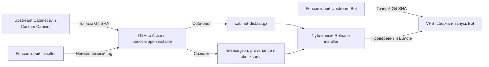

# Как устроены установка и обновление

Этот документ простыми словами объясняет, откуда установщик получает Bot,
Cabinet и Docker-образы. Строгий формат `release.json` и правила проверки
описаны отдельно в [техническом контракте Release Bundle](release-bundle.md).

## Короткий ответ

| Компонент | Где находятся исходники | Откуда компонент попадает на VPS |
|---|---|---|
| Installer | Репозиторий `installer` | Архив из публичного Release `installer` |
| Upstream Bot | Upstream-репозиторий Bot | VPS скачивает точный Git SHA и собирает Bot |
| Cabinet frontend | Upstream Cabinet или публичный Custom Cabinet | VPS скачивает готовый `cabinet-dist.tar.gz` из Release `installer` |
| PostgreSQL и Redis | Реестры Docker-образов | VPS скачивает образы по неизменяемым `@sha256` digest |

Изменение в `main` upstream-репозитория само по себе не обновляет работающий
сервер. Production-обновление становится доступно только после публикации
нового проверенного Release Bundle.

## Термины без DevOps-сленга

- **Release Bundle** — согласованный комплект одной версии Installer, Bot,
  Cabinet и Docker-образов.
- **Manifest `release.json`** — небольшой файл-список, в котором записано, какие
  именно версии и файлы разрешено установить.
- **Git SHA** — уникальный номер конкретного состояния исходников. В отличие от
  `main`, уже выбранный SHA не начинает указывать на новый код.
- **Checksum или digest SHA-256** — цифровой отпечаток файла или Docker-образа.
  Несовпадение отпечатка останавливает установку.
- **Fork** — ваша копия чужого репозитория, в которой можно хранить собственные
  изменения Cabinet.
- **GitHub Actions runner** — временный сервер GitHub, на котором выполняется
  сборка и проверка Release.

## Что такое артефакт Cabinet

Исходники Cabinet — это файлы разработчика: TypeScript/React, настройки сборки
и описание зависимостей. Браузер не должен получать их в таком виде.

`cabinet-dist.tar.gz` — артефакт, то есть уже собранный результат: HTML, CSS,
JavaScript и другие статические файлы. Его можно сразу развернуть на VPS без
установки Node.js-зависимостей и без сборки frontend на production-сервере.

Контрольная сумма SHA-256 артефакта записана в `release.json`. Перед заменой
Cabinet установщик пересчитывает её для скачанного файла. Повреждённый или
подменённый файл не применяется.

## Откуда что скачивается

GitHub Actions работает на сервере GitHub, а не на компьютере владельца.
Компьютер нужен только для подготовки изменений, отправки tag и запуска
workflow. После публикации VPS скачивает необходимые файлы напрямую с GitHub.

## Первая установка

1. Installer получает `release.json` из выбранного Release Bundle.
2. Проверяет формат manifest, совместимость Bot и Cabinet, Git SHA, image
   digests и checksum Cabinet.
3. Скачивает репозиторий Bot и переключается строго на SHA из manifest.
4. Скачивает готовый `cabinet-dist.tar.gz` по URL из manifest.
5. Скачивает PostgreSQL и Redis по неизменяемым image digests.
6. Собирает Bot на VPS, разворачивает Cabinet и запускает стек.
7. Считает установку успешной только после обязательных health checks.

## Production-обновление

Пункт меню `Обновления -> Обновить всё из Release Bundle` не берёт последние
изменения из ветки `main`. Он применяет только версии, зафиксированные в
конкретном `release.json`.

1. Maintainer выбирает точные SHA новых Bot и Cabinet.
2. GitHub Actions создаёт новый Release Bundle и собирает Cabinet.
3. Installer на VPS скачивает новый manifest и Cabinet artifact.
4. До изменения runtime проверяются manifest, repositories, SHA, digests и checksum.
5. Installer делает защищённый PostgreSQL dump и сохраняет прежнее состояние.
6. Bot и Cabinet обновляются как одна совместимая группа.
7. При успешных health checks изменение фиксируется.
8. При обратимой ошибке installer возвращает предыдущие Bot, Cabinet repository и базу
   данных. Если безопасность отката доказать нельзя, Bot остаётся остановленным
   с recovery plan.

При смене Cabinet source repository Installer показывает новый HTTPS URL перед
подтверждением. Commit атомарно сохраняет новый URL, а rollback возвращает
предыдущие URL, Git origin, SHA и Cabinet artifact.

Поэтому выход новой upstream-версии не меняет VPS автоматически. Сначала
владелец installer осознанно выпускает новый Bundle с подтверждёнными версиями.

Schema v2 фиксирует Cabinet repository вместе с SHA. На существующей VPS сначала
запустите Installer из архива того же или более нового tag, чтобы обновить
management-копию, и только затем применяйте schema v2 `release.json`. Старый
Installer отклоняет неизвестную schema до изменения runtime.

## Custom Cabinet

Default source для новых сборок уже настроен на публичный Custom Cabinet:
<https://github.com/alexforworkgpt-source/custom-cabinet.git>.

1. Переносите изменения из явно выбранной версии Upstream Cabinet отдельным commit.
2. Храните branding и изменения в Custom Cabinet, а не в готовых файлах на VPS.
3. При публикации Bundle оставьте default `cabinet_repository` и укажите точный
   Custom Cabinet commit в `cabinet_ref`.
4. GitHub Actions соберёт артефакт из вашего fork.
5. VPS установит вашу сборку из Release `installer`.
6. Для следующего обновления перенесите нужные upstream-изменения в Custom Cabinet и
   выпустите новый Bundle.

Ручное редактирование `runtime/cabinet-dist` на VPS не является устойчивой
кастомизацией: следующее production-обновление заменит этот каталог проверенным
артефактом. Custom Cabinet публичен, поэтому workflow клонирует его без токена.

## Что находится в Release installer

Workflow публикует шесть собственных assets:

- `cabinet-dist.tar.gz` — готовый Cabinet;
- `cabinet-dist.tar.gz.sha256` — его checksum;
- `installer-<release>.tar.gz` — архив точного tag installer;
- `installer-<release>.tar.gz.sha256` — checksum installer;
- `release.json` — manifest для установки и обновления;
- `release-provenance.json` — точные Cabinet SHA и identities образов,
  использованных для сборки.

Исходники Bot и Cabinet в assets не копируются. GitHub дополнительно показывает
стандартные ссылки `Source code (zip)` и `Source code (tar.gz)` — это
автоматические архивы только репозитория `installer` для выбранного tag.

## Кто за что отвечает

- Upstream-репозитории остаются источником исходников Upstream Bot и Upstream
  Cabinet; их точные URL записываются в manifest и provenance.
- Репозиторий `installer` определяет, какие точные версии признаны совместимыми.
- GitHub Actions воспроизводимо собирает Cabinet и публикует Bundle.
- VPS применяет только Bundle, прошедший проверки, и не следует за `main`
  автоматически.
- Владелец выпуска решает, когда принять новую upstream-версию или новый commit
  Custom Cabinet.

Пошаговый чек-лист публикации находится в разделе
[«Публикация нового Release Bundle»](../RUNBOOK.md#публикация-нового-release-bundle).
